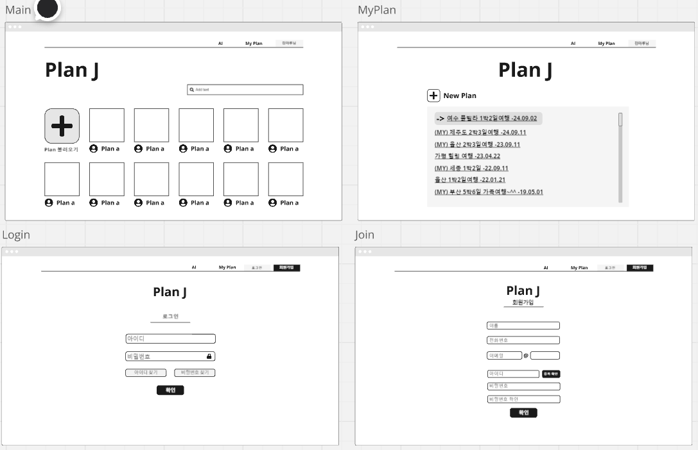

# Plan-J

<h1>여행 계획 공유 시스템</h1>

주요 기능 : 어플에 작성해놓았던 여행 계획을 전체에게 공유하는 점

공유 페이지 + 자신의 여행 계획 작성 페이지 + 검색 기능(올라온 계획 중 특정 가게가 포함된 일정도 알려줌)

부가기능 : 로그인, 회원가입 / 여행지 지도 + 가게와 숙소 -> 카카오맵이나 구글맵 API 사용 예정

커뮤니티 기능
- 여행지 관련 정보 공유
- 의뢰하기

가게 대체 추천
- 알고리즘 사용 (찾아보기)
- 거리는 다익스트라 사용 예정

- 첫날 a -> b -> c 코스, 둘째날 d -> e -> f 코스
- 근데 a -> b -> d가 거리상 효율적일 경우 수정해서 계획 제공

<h3>개발</h3>
- 사용자가 추가하는 식으로, 자유롭게 변경 가능
- 검색 기능에서 검색 앞 말머리를 지정 후 검색하기
- 지도에서 위치를 받고 (핀 찍기) -> 직선거리✕, 위치 비교
- 데이터 관리하기엔 스프링 + DB 섞어서 개발하는 게 편함
- UI : 스윙 / DB 커넥션이랑 API 서버를 스프링으로 만들고 / DB 에 데이터 저장
- chatgpt api 활용 생각해보기

